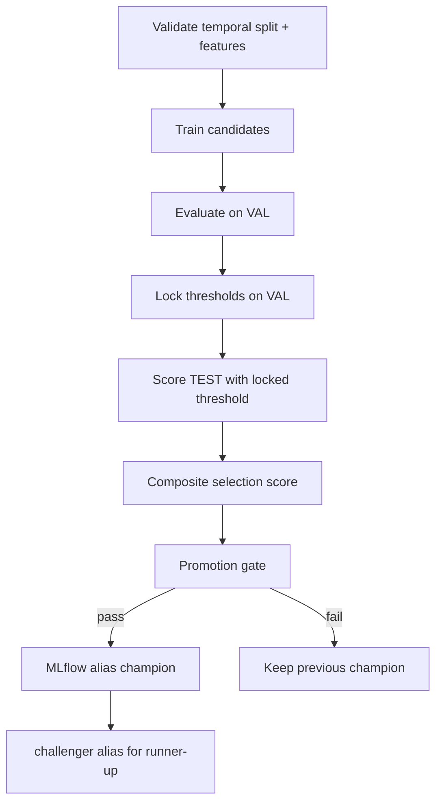

# Retraining and registry

```mermaid
flowchart TD
  V[Validate temporal split + features] --> T[Train candidates]
  T --> E[Evaluate on VAL]
  E --> TH[Lock thresholds on VAL]
  TH --> TE[Score TEST with locked threshold]
  TE --> S[Composite selection score]
  S --> G[Promotion gate]
  G -->|pass| C[MLflow alias champion]
  G -->|fail| K[Keep previous champion]
  C --> CH[challenger alias for runner-up]
```

Promote only if gates pass (FPR cap, PR-AUC vs current champion, expected cost). Aliases: `champion` / `challenger`. Local tracking URI is `file:./mlruns`.
